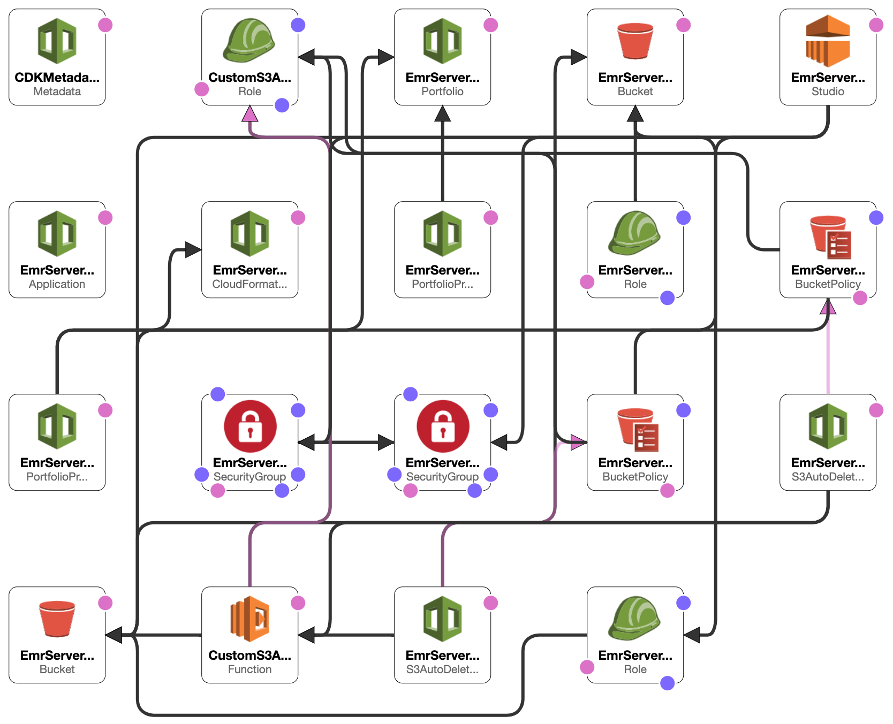
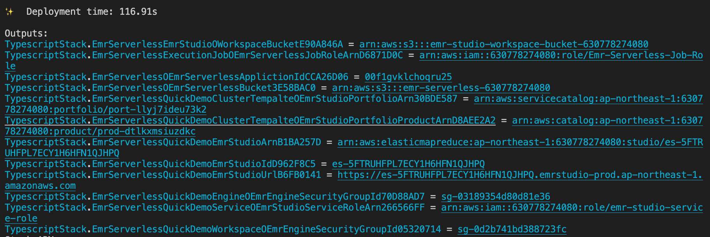
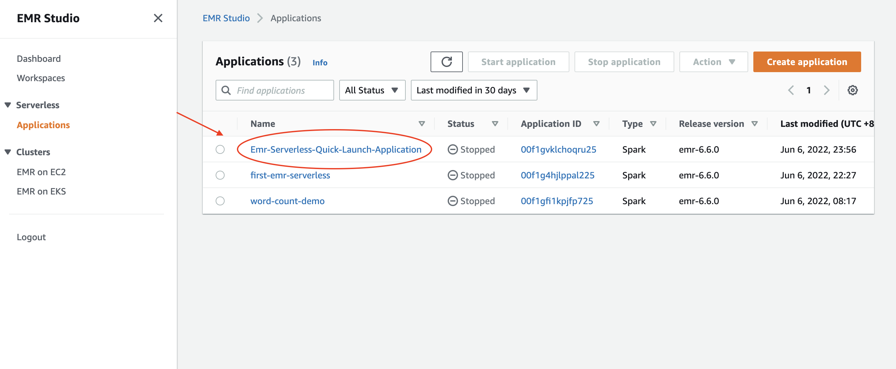
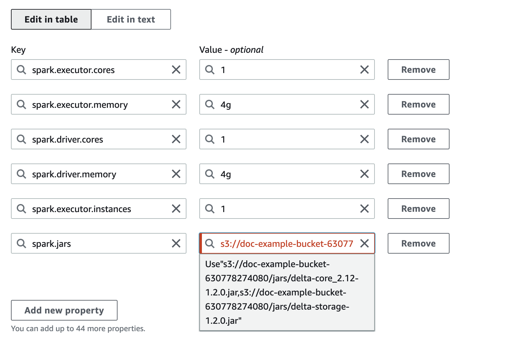

# cdk-emrserverless-with-delta-lake
   
 
This constrcut builds an EMR studio, a cluster template for the EMR Studio, and an EMR Serverless application. 2 S3 buckets will be created, one is for the EMR Studio workspace and the other one is for EMR Serverless applications. Besides, the VPC and the subnets for the EMR Studio will be tagged `{"Key": "for-use-with-amazon-emr-managed-policies", "Value": "true"}` via a custom resource. This is necessary for the [service role](https://docs.aws.amazon.com/emr/latest/ManagementGuide/emr-studio-service-role.html#emr-studio-service-role-instructions) of EMR Studio.   
This construct is for analysts, data engineers, and anyone who wants to know how to process **Delta Lake data** with EMR serverless.  
  
They build the construct via [cdkv2](https://docs.aws.amazon.com/cdk/v2/guide/home.html) and build a serverless job within the EMR application generated by the construct via AWS CLI within few minutes. After the EMR serverless job is finished, they can then check the processed result done by the EMR serverless job on an EMR notebook through the cluster template.  
   
  

# TOC  
* [Requirements](#requirements)  
* [Before deployment](#before-deployment)  
* [Minimal content for deployment](#minimal-content-for-deployment)  
* [After deployment](#after-deployment)  
* [Create an EMR Serverless application](#create-an-emr-serverless-app)  
* [Check the executing job](#check-the-executing-job)  
* [Check results from an EMR notebook via cluster template](#check-results-from-an-emr-notebook-via-cluster-template)  
* [Fun facts](#fun-facts)  
* [Future work](#future-work)  

# Requirements  
1. Your current identity has the `AdministratorAccess` power.  
2. [An IAM user](https://docs.aws.amazon.com/IAM/latest/UserGuide/getting-started_create-admin-group.html) named `Administrator` with the `AdministratorAccess` power.  
    * This is related to the Portfolio of AWS Service Catalog created by the construct, which is required for [EMR cluster tempaltes](https://docs.aws.amazon.com/emr/latest/ManagementGuide/emr-studio-cluster-templates.html).  
    * You can choose whatsoever identity you wish to associate with the Product in the Porfolio for creating an EMR cluster via cluster tempalte. Check `serviceCatalogProps` in the `EmrServerless` construct for detail, otherwise, the IAM user mentioned above will be chosen to set up with the Product.   
3. Choose proper subnet (IDs) from the default VPC, other than which you can choose your destined VPC, for the `EmrServerless` construct.  
   * You gotta check security issue yourself if you choose an alternative VPC. In this construct, the default VPC is set and for the quickiest deployment, you select proper subnets (IDs) from you default VPC and deploy it.  
# Before deployment  
You might want to execute the following command.  
```sh
PROFILE_NAME="scott.hsieh"
# If you only have one credentials on your local machine, just ignore `--profile`, buddy.  
cdk bootstrap aws://${AWS_ACCOUNT_ID}/${AWS_REGION} --profile ${PROFILE_NAME}
```  
# Minimal content for deployment  
```ts
#!/usr/bin/env node
import * as cdk from 'aws-cdk-lib';
import { Construct } from 'constructs';
import { EmrServerless } from 'cdk-emrserverless-with-delta-lake';

class TypescriptStack extends cdk.Stack {
  constructor(scope: Construct, id: string, props?: cdk.StackProps) {
    super(scope, id, props);
    new EmrServerless(this, 'EmrServerless', {
      subnetIds: ['subnet-a4bfe38c', 'subnet-278b3050', 'subnet-3571a36c']
    });
  }
}

const app = new cdk.App();
new TypescriptStack(app, 'TypescriptStack', {
  stackName: 'emr-studio',
  env: {
    region: process.env.CDK_DEFAULT_REGION,
    account: process.env.CDK_DEFAULT_ACCOUNT,
  },
});
```
# After deployment  
Promise me, darling, make advantage on the CloudFormation outputs.  All you need is **copy-paste**, **copy-paste**, **copy-paste**, life should be always that easy.    
  
1. **Define the following environment variables on your current session.**  
    ```
    export PROFILE_NAME="${YOUR_PROFILE_NAME}"
    export JOB_ROLE_ARN="${copy-paste-thank-you}"
    export APPLICATION_ID="${copy-paste-thank-you}"
    export SERVERLESS_BUCKET_NAME="${copy-paste-thank-you}"
    export DELTA_LAKE_SCRIPT_NAME="delta-lake-demo"
    ```  
2. **Copy partial NYC-taxi data into the EMR Serverless bucket.**    
   ```sh
   aws s3 cp s3://nyc-tlc/trip\ data/ s3://${SERVERLESS_BUCKET_NAME}/nyc-taxi/ --exclude "*" --include "yellow_tripdata_2021-*.parquet" --recursive --profile ${PROFILE_NAME}
   ```
3. **Create a Python script for processing Delta Lake**  
    ```sh
    touch ${DELTA_LAKE_SCRIPT_NAME}.py
    cat << EOF > ${DELTA_LAKE_SCRIPT_NAME}.py
    from pyspark.sql import SparkSession
    import uuid

    if __name__ == "__main__":
        """
            Delta Lake with EMR Serverless, take NTC taxi as example.
        """
        spark = SparkSession \\
            .builder \\
            .config("spark.sql.extensions", "io.delta.sql.DeltaSparkSessionExtension") \\
            .config("spark.sql.catalog.spark_catalog", "org.apache.spark.sql.delta.catalog.DeltaCatalog") \\
            .enableHiveSupport() \\
            .appName("Delta-Lake-OSS") \\
            .getOrCreate()

        url = "s3://${SERVERLESS_BUCKET_NAME}/emr-serverless-spark/delta-lake/output/1.2.1/%s/" % str(
            uuid.uuid4())

        # creates a Delta table and outputs to target S3 bucket
        spark.range(5).write.format("delta").save(url)

        # reads a Delta table and outputs to target S3 bucket
        spark.read.format("delta").load(url).show()

        # The source for the second Delta table.
        base = spark.read.parquet(
            "s3://${SERVERLESS_BUCKET_NAME}/nyc-taxi/*.parquet")

        # The sceond Delta table, oh ya.
        base.write.format("delta") \\
            .mode("overwrite") \\
            .save("s3://${SERVERLESS_BUCKET_NAME}/emr-serverless-spark/delta-lake/nyx-tlc-2021")
        spark.stop()
    EOF
    ```
4. **Upload the script and required jars into the serverless bucket**  
   ```sh
   # upload script
   aws s3 cp delta-lake-demo.py s3://${SERVERLESS_BUCKET_NAME}/scripts/${DELTA_LAKE_SCRIPT_NAME}.py --profile ${PROFILE_NAME}
   # download jars and upload them
   DELTA_VERSION="1.2.0"
   DELTA_LAKE_CORE="delta-core_2.12-${DELTA_VERSION}.jar"
   DELTA_LAKE_STORAGE="delta-storage-${DELTA_VERSION}.jar"
   curl https://repo1.maven.org/maven2/io/delta/delta-core_2.12/${DELTA_VERSION}/${DELTA_LAKE_CORE} --output ${DELTA_LAKE_CORE}
   curl https://repo1.maven.org/maven2/io/delta/delta-storage/${DELTA_VERSION}/${DELTA_LAKE_STORAGE} --output ${DELTA_LAKE_STORAGE}
   aws s3 mv ${DELTA_LAKE_CORE} s3://${SERVERLESS_BUCKET_NAME}/jars/${${DELTA_LAKE_CORE}} --profile ${PROFILE_NAME}
   aws s3 mv ${DELTA_LAKE_STORAGE} s3://${SERVERLESS_BUCKET_NAME}/jars/${DELTA_LAKE_STORAGE} --profile ${PROFILE_NAME}
   ```  
# Create an EMR Serverless app  
Rememeber, you got so much information to copy and paste from the CloudFormation outputs.  
   
```sh
aws emr-serverless start-job-run \
  --application-id ${APPLICATION_ID} \
  --execution-role-arn ${JOB_ROLE_ARN} \
  --name 'shy-shy-first-time' \
  --job-driver '{
        "sparkSubmit": {
            "entryPoint": "s3://'${SERVERLESS_BUCKET_NAME}'/scripts/'${DELTA_LAKE_SCRIPT_NAME}'.py",
            "sparkSubmitParameters": "--conf spark.executor.cores=1 --conf spark.executor.memory=4g --conf spark.driver.cores=1 --conf spark.driver.memory=4g --conf spark.executor.instances=1 --conf spark.jars=s3://'${SERVERLESS_BUCKET_NAME}'/jars/delta-core_2.12-1.2.0.jar,s3://'${SERVERLESS_BUCKET_NAME}'/jars/delta-storage-1.2.0.jar"
        }
    }' \
  --configuration-overrides '{
        "monitoringConfiguration": {
            "s3MonitoringConfiguration": {
                "logUri": "s3://'${SERVERLESS_BUCKET_NAME}'/serverless-log/"
	        }
	    }
	}' \
	--profile ${PROFILE_NAME}
```  
If you execute with success, you should see similar reponse as the following:  
```sh
{
    "applicationId": "00f1gvklchoqru25",
    "jobRunId": "00f1h0ipd2maem01",
    "arn": "arn:aws:emr-serverless:ap-northeast-1:630778274080:/applications/00f1gvklchoqru25/jobruns/00f1h0ipd2maem01"
}
```  
and got a Delta Lake data under `s3://${SERVERLESS_BUCKET_NAME}/emr-serverless-spark/delta-lake/nyx-tlc-2021/`.  
  

# Check the executing job    
Access the EMR Studio via the URL from the CloudFormation outputs. It should look very similar to the following url: `https://es-pilibalapilibala.emrstudio-prod.ap-northeast-1.amazonaws.com`, i.e., weird string and region won't be the same as mine.  
1. **Enter into the application**  
     
2. **Enter into the executing job**  

# Check results from an EMR notebook via cluster template  
1. Create a workspace and an EMR cluster via the cluster template on the AWS Console  
       
2. Check the results delivered by the EMR serverless application via an EMR notebook.  

# Fun facts  
1. You can assign multiple jars as a comma-separated list to the `spark.jars` as [the Spark page](https://spark.apache.org/docs/latest/configuration.html#runtime-environment) says for your EMR Serverless job. The UI will complain, you still can start the job. Don't be afraid, just click it like when you were child, facing authority fearlessly.  
  
2. To fully delet a stack with the construct, you need to make sure there is no more workspace within the EMR Studio. Aside from that, you also need to remove the associated identity from the Service Catalog (this is a necessary resource for the cluster template).  
3. Version inconsistency on Spark history. Possibly it can be ignored yet still made me wonder why the versions are different.  
     
4. So far, I still haven't figured out how to make the s3a URI work. The s3 URI is fine while the serverless app will complain that it couldn't find proper credentials provider to read the s3a URI.  

# Future work
1. Custom resuorce for EMR Serverless
2. Make the construct more flexible for users
3. Compare Databricks Runtime and EMR Serverless.  
